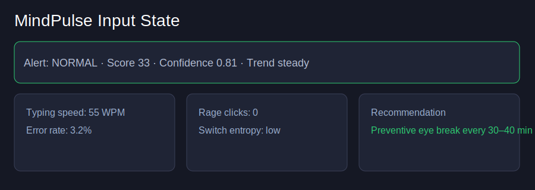
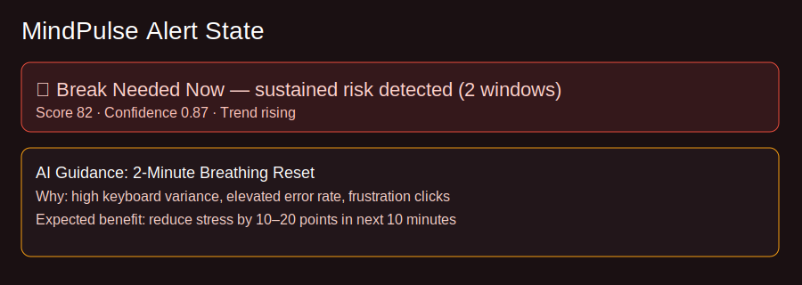
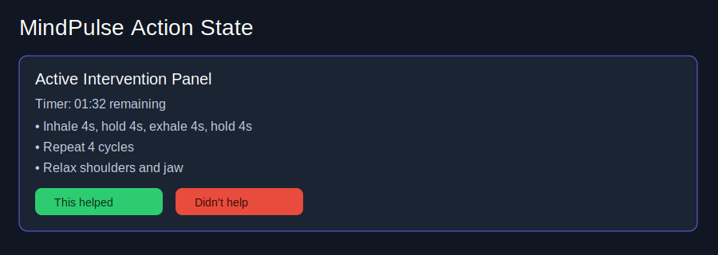
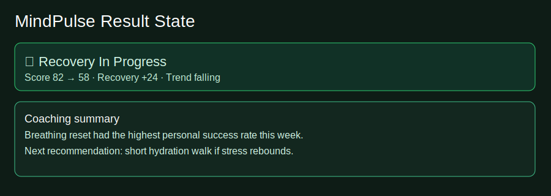

# MindPulse Stress Alert + AI Guidance — Implementation Pack

## What was implemented

- Sustained-risk alert state machine with `NORMAL`, `EARLY_WARNING`, `BREAK_RECOMMENDED`, `RECOVERY`
- Anti-spam controls: streak-based trigger + cooldown + snooze handling
- AI intervention recommendations with personalization from user outcome history
- User actions: `start_break`, `snooze`, `im_okay`, `need_stronger_help`
- Outcome loop: `helped`, `not_helped`, `skipped` with recovery score tracking
- New **Interventions** page and navigation
- History + Insights expansion for alert/intervention context
- Privacy text updates for intervention metadata handling

## Input and result visuals

### 1) Input (normal state)

### 2) Alert shown (break recommended)

### 3) Action phase (active intervention)

### 4) Result (recovery trend)

## API additions

- `GET /api/v1/interventions/recommendation`
- `POST /api/v1/interventions/action`
- `GET /api/v1/interventions/history`

## Demo flow (reproducible)

1. Start backend and frontend.
2. Start data collection client (`backend/run_client.py`) and produce stressed behavior using `backend/simulate_stress.py`.
3. Open `/tracking` and wait for `BREAK_RECOMMENDED`.
4. Click **Start break timer**, then submit outcome feedback.
5. Verify improvements in `/history`, `/insights`, and `/interventions`.

## Added feature nuances (ready for next iteration)

- Circadian-aware adaptive thresholds
- Burnout risk trend (7-day load vs recovery debt)
- Context-switch overload detector
- Focus protection mode
- Energy forecast card
- Team-safe anonymized analytics
- Escalation ladder for repeated non-recovery
