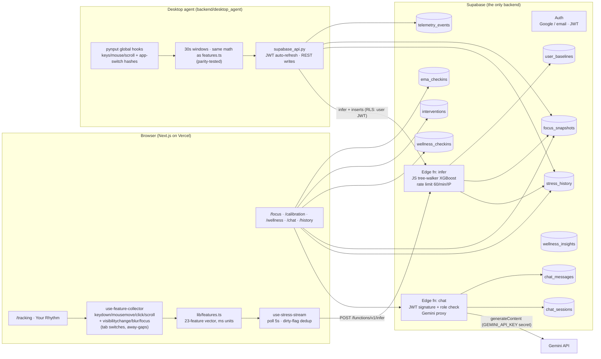
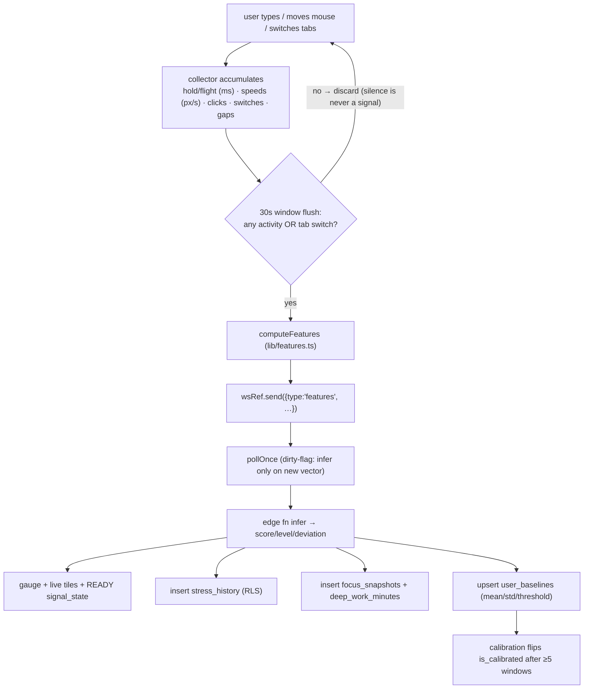
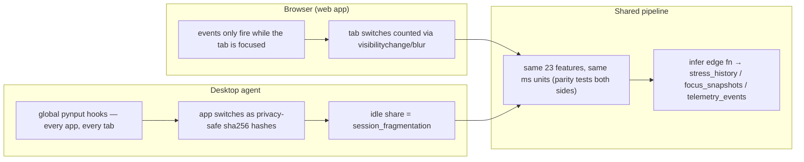
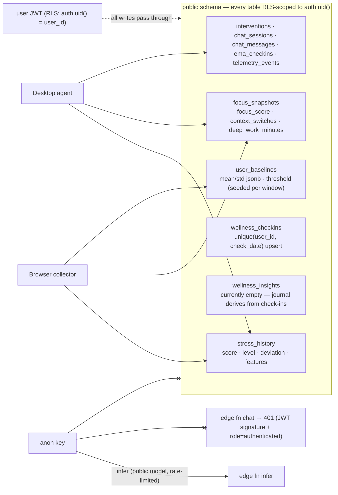
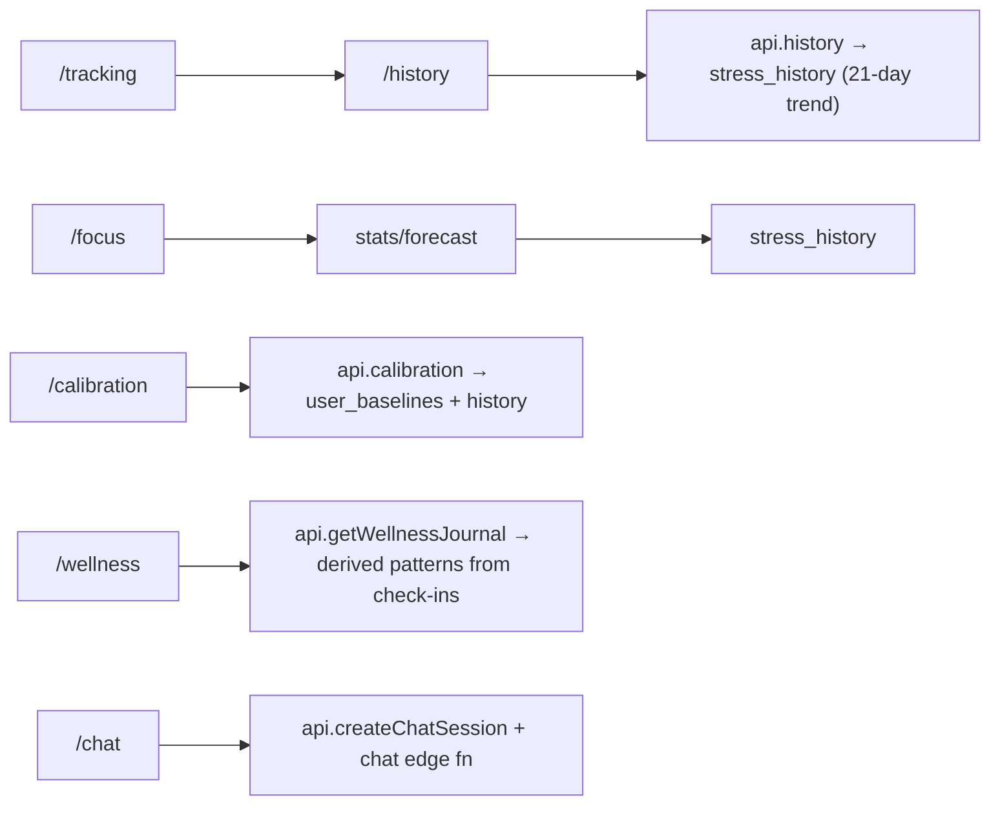
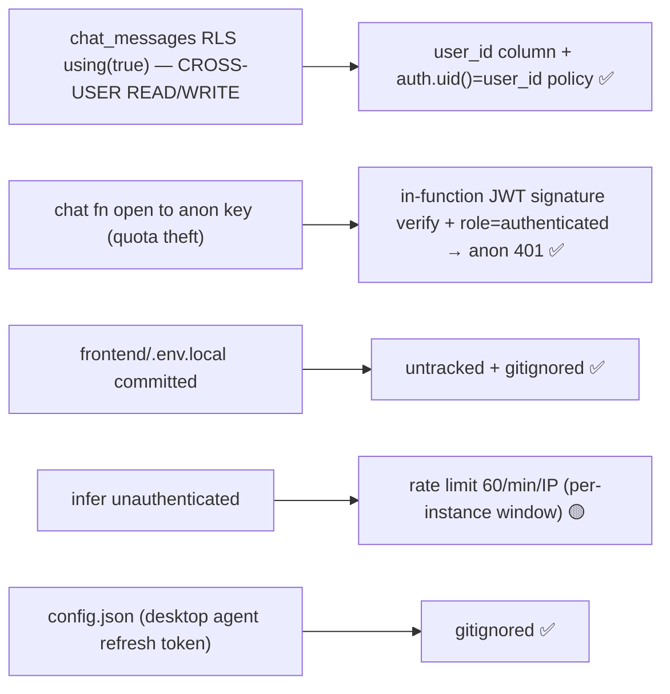

# MindPulse — Codebase Diagrams

Rendered on GitHub automatically. Paste any block into Claude for discussion.

## 1. System architecture (what talks to what)

## 2. Browser telemetry data flow (the live gauge chain)

## 3. Desktop agent (full-OS coverage) vs browser (tab-only)

## 4. Data tables + RLS (who can touch what)

## 5. Page → hook → API map

## 6. Security posture (what was fixed, what holds)

## 7. Known open items (for discussion)

1. Live gauge shows browser windows only — desktop windows land in History/Focus/Calibration. Live desktop→web streaming = Supabase Realtime (not wired).
2. `wellness_insights` table has no generator — journal derives client-side instead.
3. `infer` rate limit is per-instance memory (no global counter on free tier).
4. Frontend tests: vitest on `lib/features.ts` only (3 tests). Backend: 11 tests incl. agent parity.
5. Legacy FastAPI backend + Tauri shell still in repo — not part of the deployed stack.
